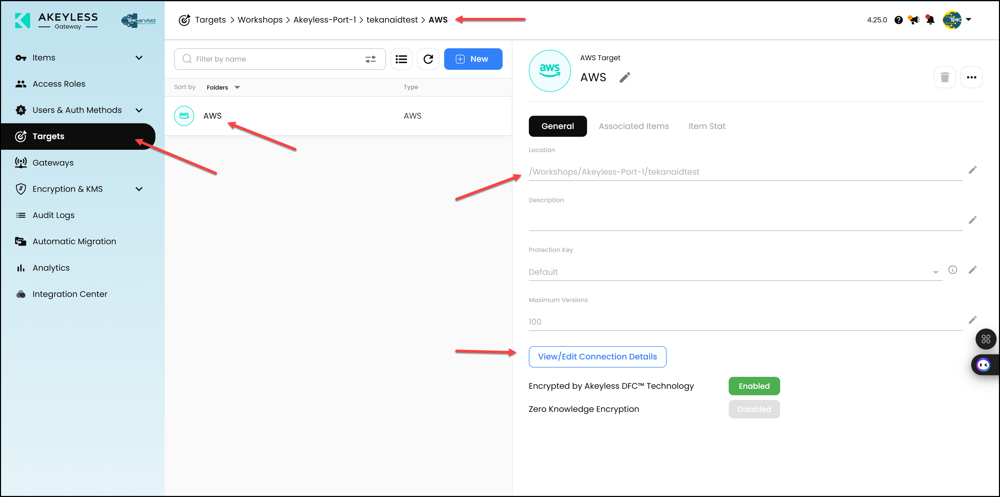
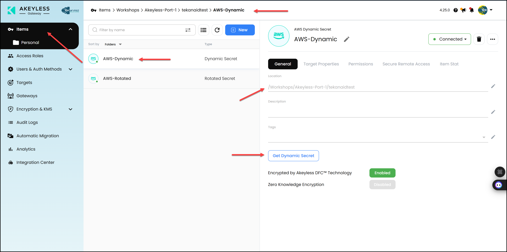

# Akeyless Setup

This lab will help you set up Akeyless in your minikube Kubernetes cluster and create a gateway.

Key Objectives:
- Access Akeyless via OIDC
- Create an API Key and associate it with an Access Role
- Create a Gateway in Akeyless
- Give permissions to access the Gateway
- Check the Gateway from the Akeyless Console 
- Create a Target, Rotated Secret, and Dynamic Secret in Akeyless

Table of Contents:

- [Akeyless Setup](#akeyless-setup)
  - [1. Access Akeyless via OIDC](#1-access-akeyless-via-oidc)
    - [1.1 Login to Akeyless UI via OIDC](#11-login-to-akeyless-ui-via-oidc)
    - [1.2 Login to Akeyless CLI via OIDC](#12-login-to-akeyless-cli-via-oidc)
    - [1.3 Run a script to create an API Key and associate it with an Access Role](#13-run-a-script-to-create-an-api-key-and-associate-it-with-an-access-role)
  - [2. Create a Gateway in Akeyless](#2-create-a-gateway-in-akeyless)
    - [2.1 Create the Gateway](#21-create-the-gateway)
    - [2.2 Expose the Gateway Port 8000](#22-expose-the-gateway-port-8000)
    - [2.3 Give Permission](#23-give-permission)
    - [2.4 Check the Gateway from the Akeyless Console](#24-check-the-gateway-from-the-akeyless-console)
  - [3. Create a Target, Rotated Secret, and Dynamic Secret in Akeyless](#3-create-a-target-rotated-secret-and-dynamic-secret-in-akeyless)


## 1. Access Akeyless via OIDC

### 1.1 Login to Akeyless UI via OIDC

Go to https://console.akeyless.io and click on `OIDC` and NOT `GitHub` under the `Sign in` button, then enter this `OIDC Access ID` ***`p-j1ej0z1eudthim`*** then click `Sign in`. This will redirect you to GitHub to login. You will need to approve the access.


### 1.2 Login to Akeyless CLI via OIDC

Open a new terminal in your codespace and run the following commands (don't worry if you get an error like this when running `akeyless --init`: `ERR! undefined option --init`) this is expected since we have already initialized the CLI in the previous lab:

```bash
akeyless --init
akeyless auth --access-id=p-j1ej0z1eudthim --access-type=oidc --use-remote-browser
```

You may get a prompt saying:
```
AKEYLESS-CLI, first use detected
For more info please visit: https://docs.akeyless.io/docs/cli
Enter Akeyless URL (Default: vault.akeyless.io)
```

Just press `Enter` to use the default URL.

Then you will get a prompt saying:
```
Would you like to configure a profile? (Y/n)
```

Click `n` to not configure a profile.

Finally, you will get a prompt saying:

```
Would you like to move 'akeyless' binary to: /home/codespace/.akeyless/bin/akeyless? (Y/n)
```

Click `n` to not move the binary.

Then you can re-run the command:

```bash
akeyless auth --access-id=p-j1ej0z1eudthim --access-type=oidc --use-remote-browser
```

You will get an output that says:

```
Open the link below in your browser in order to complete the authentication:
Link: https://auth.akeyless.io/oidc-login?access_id=p-j1ej0z1eudthim&redirect_uri=https://auth-relay.akeyless.io/creds-login&is_short_token=true
```

Click on the link above and login with your GitHub account.

Then you will get a screen that says the following:


Click on the `Show Token` button and copy the token and save it somewhere to be used in the next step.


### 1.3 Run a script to create an API Key and associate it with an Access Role
```bash
Lab02/create_api_key.sh
```

This script does the following:

1. Gets your GitHub username from the git remote URL
2. Prompts you for your OIDC token and saves it to a file
3. Creates an API key auth method under `/Workshops/Akeyless-Port-1/<your-github-username>/APIkey` if it doesn't exist, or resets the existing one
4. Saves the API key credentials (name, access ID, and access key) to `creds_api_key_auth.json`
5. Associates the API key with the `/Workshops/Akeyless-Port-1` access role if not already associated

The generated API key credentials will be used later for authentication with the Akeyless gateway.

## 2. Create a Gateway in Akeyless

### 2.1 Create the Gateway

Run the following script to get the values.yaml file ready for the Helm chart to deploy the gateway.

```bash
Lab02/prepare_gateway_config.sh
```

Then run the following commands in the `Terminal` of your GitHub codespace.

```bash
helm upgrade --install gw akeyless/akeyless-gateway --namespace akeyless -f values.yaml

kubens akeyless
```

Check the gateway logs and wait until they stop:

```bash
watch kubectl get pods -n akeyless
```
Sample Output:
```
NAME                            TYPE           CLUSTER-IP      EXTERNAL-IP   PORT(S)          AGE
gw-akeyless-gateway             LoadBalancer   10.109.213.92   <pending>     8000:32161/TCP   6m8s
gw-akeyless-gateway-cache-svc   ClusterIP      10.104.3.143    <none>        6379/TCP         6m8s
gw-akeyless-gateway-internal    ClusterIP      10.98.4.168     <none>        8080/TCP         6m8s
```

Hit `Ctrl+C` to stop

### 2.2 Expose the Gateway Port 8000

First, open a new terminal in your codespace and run the following command:
```bash
kubectl port-forward svc/gw-akeyless-gateway 8000:8000 -n akeyless
```

Then, in the codespace, click on the `PORTS` tab beside the `TERMINAL` tab and right click on port `8000` and change the `Port Visibility` to `Public`.


### 2.3 Give Permission

Login to the Gateway from your browser by clicking on the `PORTS` tab beside the `TERMINAL` tab and click the globe icon to open in a browser for port `8000`. 


Approve the access to this port.


Login using your API key credentials found in the `creds_api_key_auth.json` file in Lab03.


Click on `Access Permissions` then on the `New` button.

Give it a name `APIkey` and choose the `/Workshops/Akeyless-Port-1/<your-github-username>/APIkey` Auth method then click `Next.` Leave `Admin` selected and then click `Finish`.


Add another permission for the OIDC auth method: `/Workshops/TeKanAid Academy GitHub`


then click `Next.` Leave `Admin` selected and then click `Finish`.

### 2.4 Check the Gateway from the Akeyless Console

Now refresh the Akeyless Console browser and click on the `Gateway` tab to see your gateway registered with the console.


## 3. Create a Target, Rotated Secret, and Dynamic Secret in Akeyless

Open a new terminal in your codespace.

Run this script to create a target, rotated secret, and dynamic secret in Akeyless.

```bash
Lab02/create_dynamic_aws_secret.sh
```

This script does the following:

1. Creates a target in Akeyless
2. Creates a rotated secret in Akeyless
3. Creates a dynamic secret in Akeyless

Spend some time to understand the script and the output.

Go to the Akeyless Console and check the newly created Target that we will use to create an AWS dynamic secret. Go to the `Targets` tab.



Check both the rotated secret and the dynamic secret in the Akeyless Console. You can manually rotate the secret and create a new dynamic secret. Give it a try.




> You've reached the end of the lab.
