# Akeyless Setup

- [Akeyless Setup](#akeyless-setup)
  - [1. Create an Akeyless Account](#1-create-an-akeyless-account)
    - [1.1 Create an API Key](#11-create-an-api-key)
    - [1.2 Associate the Auth Method with an Access Role](#12-associate-the-auth-method-with-an-access-role)
  - [2. Create a Gateway in Akeyless](#2-create-a-gateway-in-akeyless)
    - [2.1 Create the Gateway](#21-create-the-gateway)
    - [2.2 Expose the Gateway Port 8000](#22-expose-the-gateway-port-8000)
    - [2.3 Give Permission](#23-give-permission)
    - [2.4 Check the Gateway from the Akeyless Console](#24-check-the-gateway-from-the-akeyless-console)
  - [3. Log into the Akeyless CLI](#3-log-into-the-akeyless-cli)
    - [Update the Default Akeyless Profile](#update-the-default-akeyless-profile)
    - [3.1 Test the Credentials with the CLI](#31-test-the-credentials-with-the-cli)
  - [4. Create a Target in Akeyless](#4-create-a-target-in-akeyless)
  - [5. Create a Rotated Secret for the Target](#5-create-a-rotated-secret-for-the-target)
  - [6. Create an AWS Dynamic Secret](#6-create-an-aws-dynamic-secret)


## 1. Create an Akeyless Account

By going to https://akeyless.io and clicking on the Start Free button.

### 1.1 Create an API Key

In the Akeyless Console, go to the `Users & Auth Methods` and click the New button. Select the `API Key` Authentication method and give it the name `AdminAPI` then click `Finish`. Make sure to save these credentials.

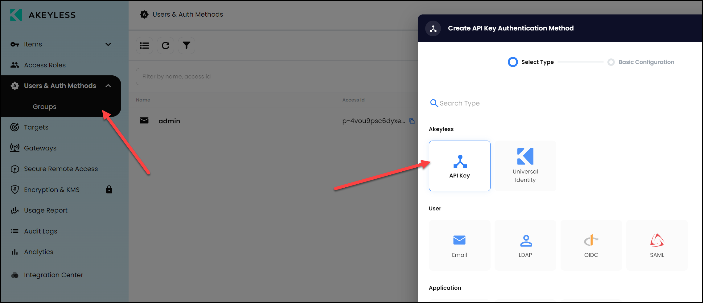

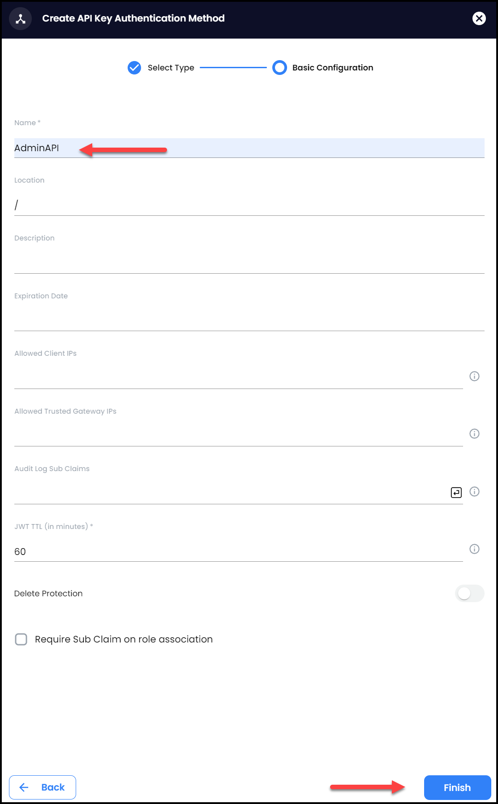

Now save the `Access ID` and `Access Key` to be used later.

### 1.2 Associate the Auth Method with an Access Role

Click on the `Access Role` tab and click on `admin` and then click on the `Associate` button and slelect the `/AdminAPI` Auth method. This way we are giving this Auth Method full admin capabilities.
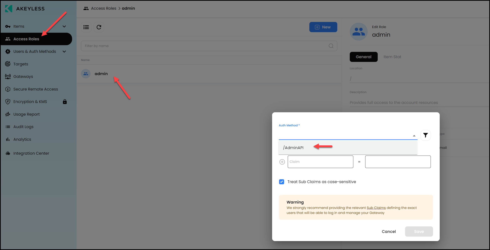

## 2. Create a Gateway in Akeyless

### 2.1 Create the Gateway

Run the following commands in the `Terminal` of your GitHub codespace.

```bash
docker run -d -p 8000:8000 -p 8200:8200 -p 18888:18888 -p 8080:8080 -p 8081:8081 -p 5696:5696 --name akeyless-gw akeyless/base
```

Check that the gateway is up and running

```bash
docker logs -f akeyless-gw
```

### 2.2 Expose the Gateway Port 8000

Click on the `PORTS` tab beside the `TERMINAL` tab and right click on port `8000` and change the `Port Visibility` to `Public`.


### 2.3 Give Permission

Login to the Gateway from your browser by clicking on the `PORTS` tab beside the `TERMINAL` tab and click the globe icon to open in a browser for port `8000`. 
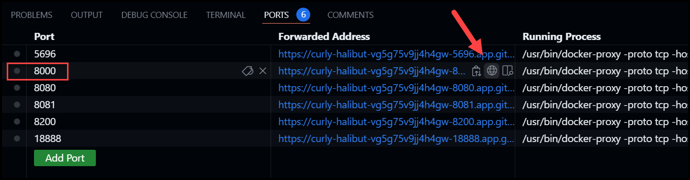

Approve the access to this port.


Login using the `Password` option 

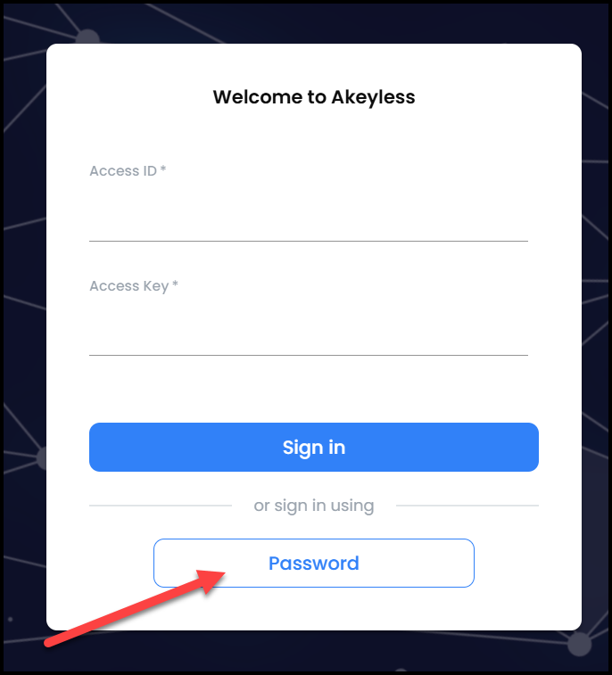

Use the same password you used to log into the Akeyless Console.

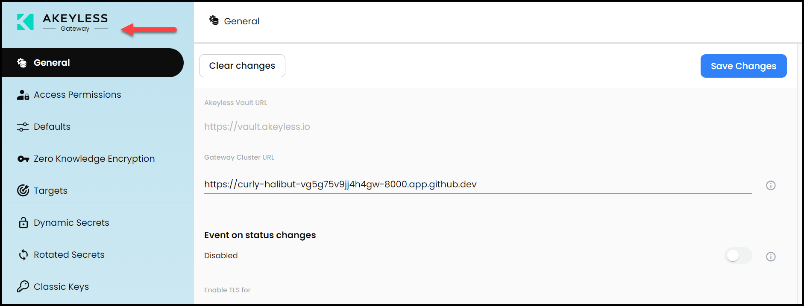

Click on `Access Permissions` then on the `New` button.

Give it a name `AdminAPI` and choose the `/AdminAPI` Auth method then click `Next.` Leave `Admin` selected and then click `Finish`.

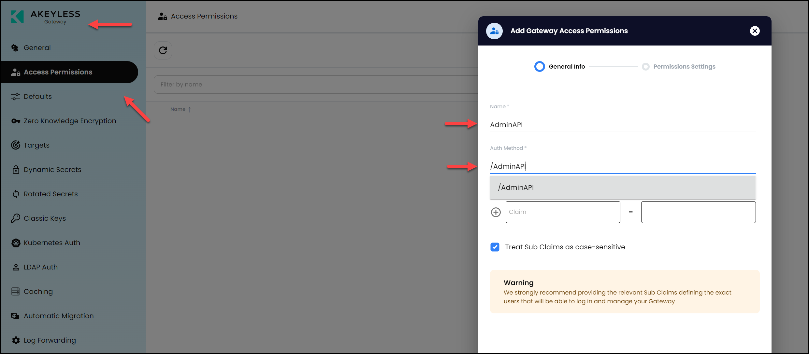

Add another permission for the `/admin` authentication method:

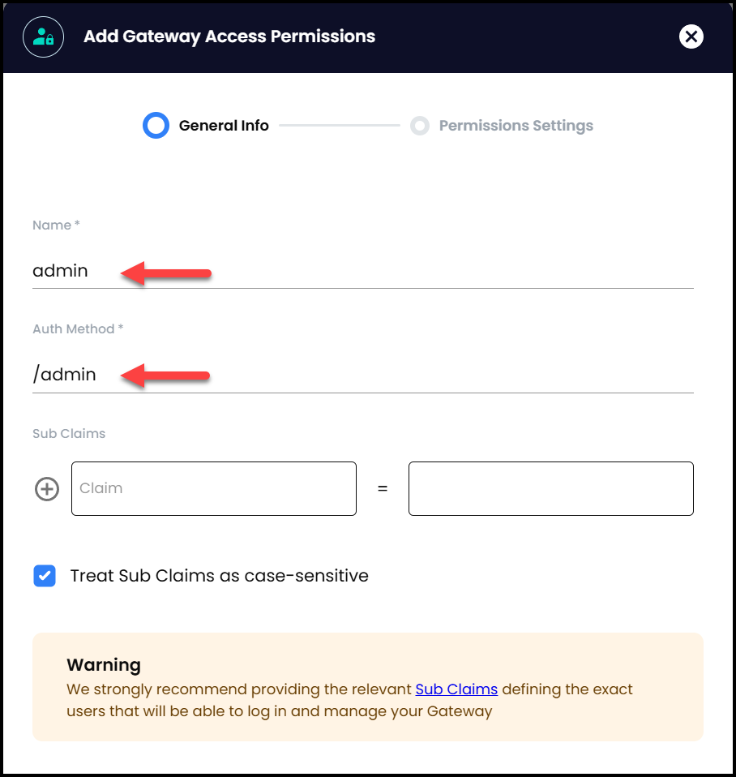

### 2.4 Check the Gateway from the Akeyless Console

Now refresh the Akeyless Console browser and click on the `Gateway` tab to see your gateway registered with the console.

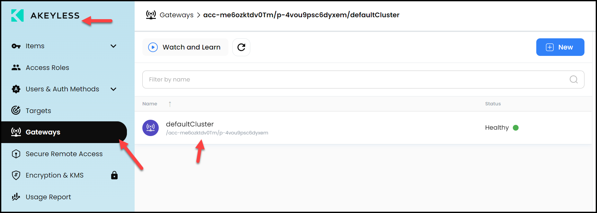

## 3. Log into the Akeyless CLI

### Update the Default Akeyless Profile

Fill in the API Key values obtained from step 1.1 below and run the commands:

```bash
export AKEYLESS_ACCESS_ID=xxx
export AKEYLESS_ACCESS_KEY=xxx
akeyless configure --profile default --access-id ${AKEYLESS_ACCESS_ID} --access-key ${AKEYLESS_ACCESS_KEY}
```

### 3.1 Test the Credentials with the CLI

Run the following command to test the CLI access to Akeyless

```bash
akeyless list-gateways
```

Sample output:
```json
{
  "clusters": [
    {
      "id": 50053,
      "cluster_name": "acc-me6ozktdv0Tm/p-4vou9psc6dyxem/defaultCluster",
      "cluster_url": "https://curly-halibut-vg5g75v9jj4h4gw-8000.app.github.dev",
      "status": "Running",
      "status_description": "",
      "display_name": "",
      "allowed": false,
      "default_protection_key_id": 0,
      "default_secret_location": "",
      "allowed_access_ids": [
        "p-4vou9psc6dyxem"
      ]
    }
  ]
}
```

## 4. Create a Target in Akeyless

You will need the AWS credentials you received in the beginning to create a target in Akeyless. You can find them by running:

```bash
cat ~/.aws/credentials
```

Then run the command below with your AWS credentials replacing the placeholders.
```bash
akeyless create-aws-target --name AWS --access-key-id <aws_access_key_id> --access-key <aws_secret_access_key> --region us-east-1
```

Example:
```bash
akeyless create-aws-target --name AWS --access-key-id AKIAQWXXXXXX --access-key duG1kRDPXXXX --region us-east-1
```

Go to the Akeyless Console and check the newly created Target that we will use to create an AWS dynamic secret. Go to the `Targets` tab.
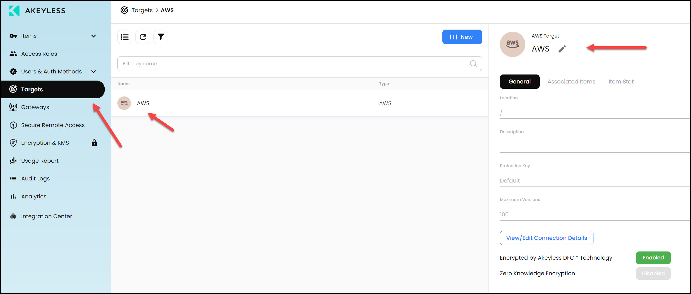

## 5. Create a Rotated Secret for the Target

Since we always say not to have any long-lived credentials. Let's create a rotated secret that will rotate our Target's AWS credentials automatically every 30 days.

Run the following command:

```bash
akeyless rotated-secret create aws \
--name /Terraform/aws-target-rotated \
--target-name /AWS \
--rotator-type target \
--auto-rotate true \
--rotation-interval 30 \
--rotation-hour 10
```

Check the Akeyless UI to see the configuration there. Go to `Items` and search for `/Terraform/aws-target-rotated`.

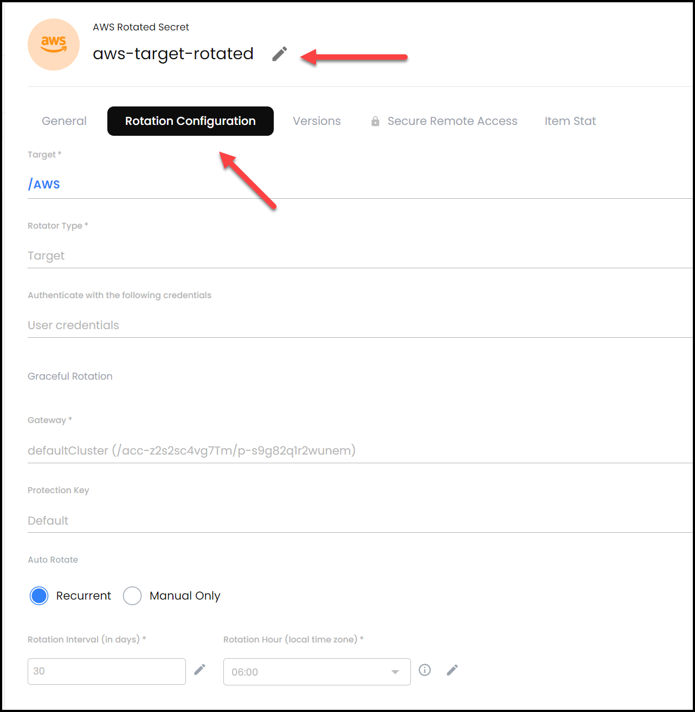

You could also manually rotate the credentials as shown below.

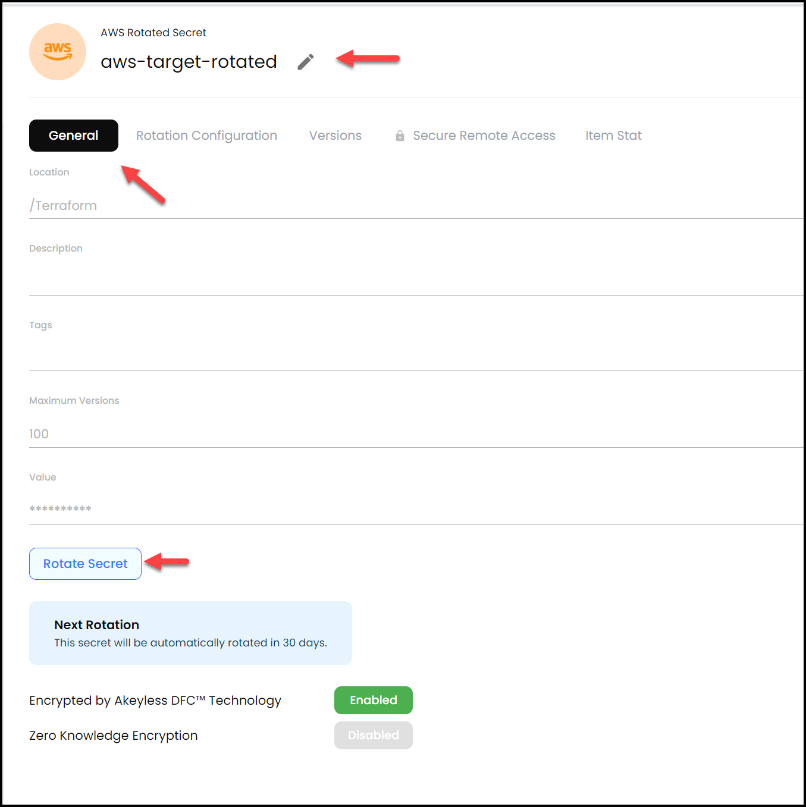

## 6. Create an AWS Dynamic Secret

Now it's time to create our AWS Dynamic Secret. You will need to update the command below with your `gateway-url`. You can find it by going into your Akeyless Console and click on `Gateways` and it's under `Gateway URL (Configuration):`

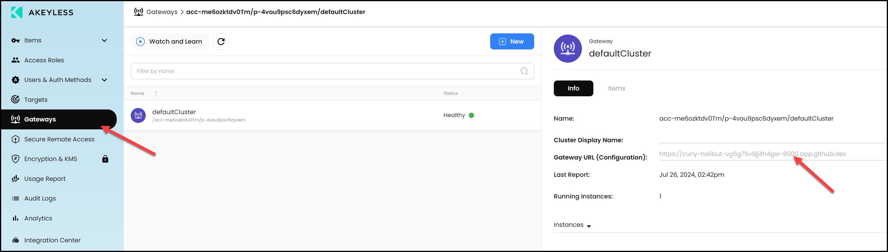

```bash
akeyless dynamic-secret create aws \
--name /Terraform/terraform-credentials \
--target-name AWS \
--gateway-url 'https://<Your-Akeyless-GW-URL:8000>' \
--aws-access-mode iam_user \
--aws-user-groups Akeyless-Workshops
```

Example:

```bash
akeyless dynamic-secret create aws \
--name /Terraform/terraform-credentials \
--target-name AWS \
--gateway-url 'https://curly-halibut-vg5g75v9jj4h4gw-8000.app.github.dev' \
--aws-access-mode iam_user \
--aws-user-groups Akeyless-Workshops
```

Now test this by fetching a dynamic AWS secret value using this command:

```bash
akeyless dynamic-secret get-value --name /Terraform/terraform-credentials
```


> You've reached the end of the lab.