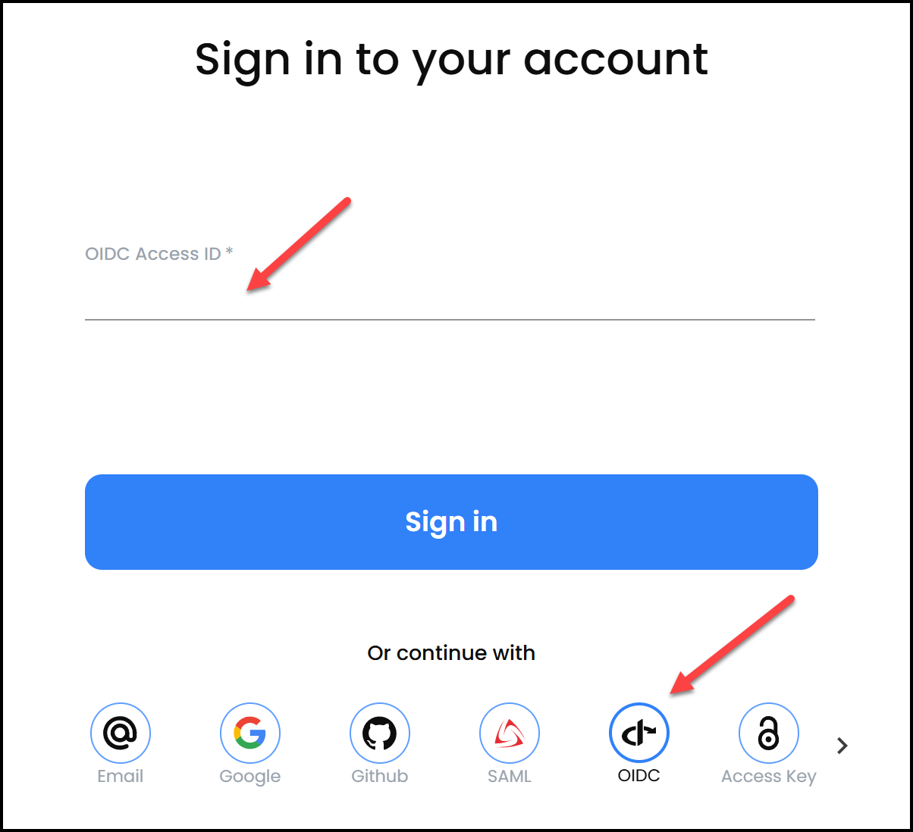
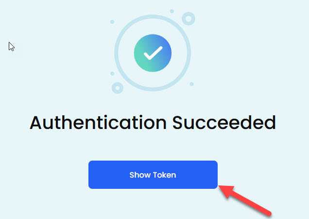
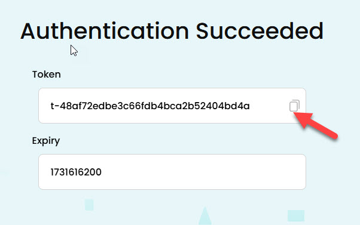
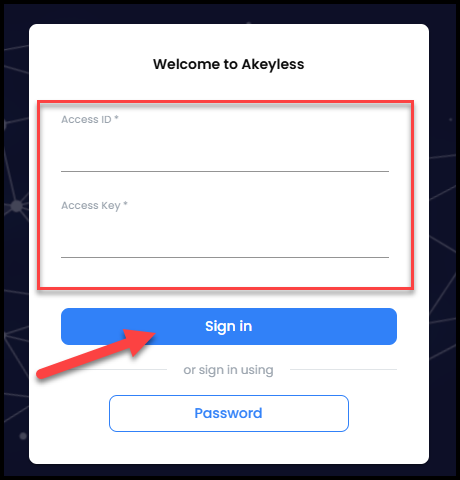
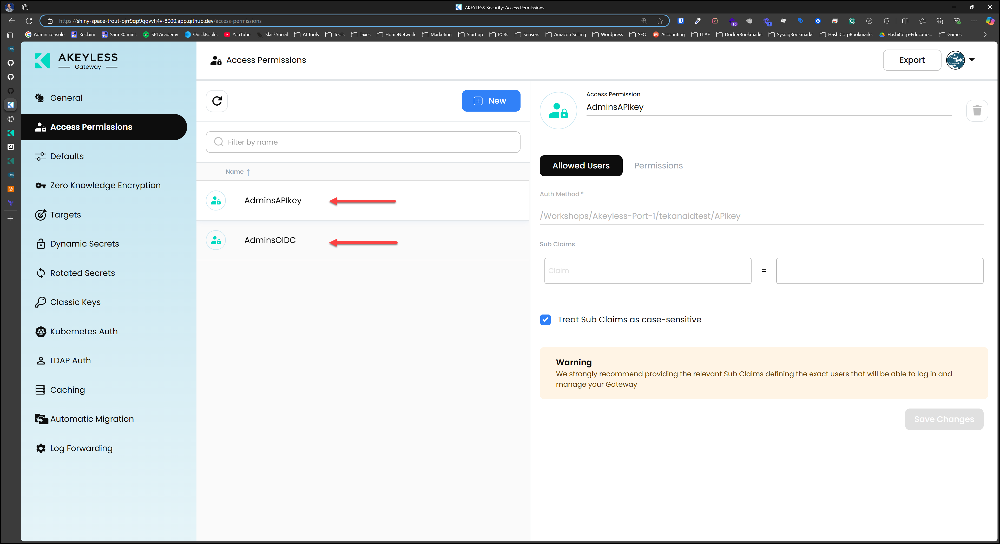
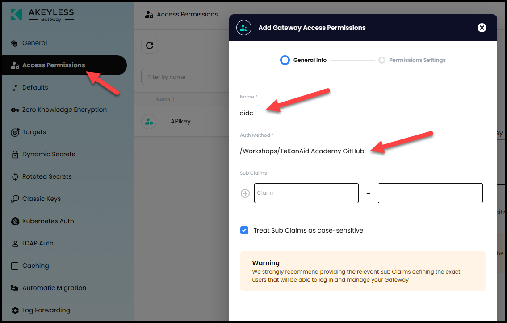

# Akeyless Setup

This lab will help you set up Akeyless in your minikube Kubernetes cluster and create a gateway.

Key Objectives:
- Access Akeyless via OIDC
- Create an API Key and associate it with an Access Role
- Create a Gateway in Akeyless
- Give permissions to access the Gateway
- Check the Gateway from the Akeyless Console 

Table of Contents:

- [Akeyless Setup](#akeyless-setup)
  - [1. Access Akeyless via OIDC](#1-access-akeyless-via-oidc)
    - [1.1 Login to Akeyless UI via OIDC](#11-login-to-akeyless-ui-via-oidc)
    - [1.2 Login to Akeyless CLI via OIDC](#12-login-to-akeyless-cli-via-oidc)
    - [1.3 Run a script to create an API Key and associate it with an Access Role](#13-run-a-script-to-create-an-api-key-and-associate-it-with-an-access-role)
  - [2. Create a Gateway in Akeyless](#2-create-a-gateway-in-akeyless)
    - [2.1 Create the Gateway](#21-create-the-gateway)
    - [2.2 Expose the Gateway Port 8000 and 8081](#22-expose-the-gateway-port-8000-and-8081)
    - [2.3 Give Permission](#23-give-permission)
    - [2.4 Check the Gateway from the Akeyless Console](#24-check-the-gateway-from-the-akeyless-console)
  - [3. Create a Target in Akeyless](#3-create-a-target-in-akeyless)
  - [4. Create a Rotated Secret for the Target](#4-create-a-rotated-secret-for-the-target)
  - [5. Create an AWS Dynamic Secret](#5-create-an-aws-dynamic-secret)


## 1. Access Akeyless via OIDC

### 1.1 Login to Akeyless UI via OIDC

Go to https://console.akeyless.io and click on `OIDC` and NOT `GitHub` under the `Sign in` button, then enter this `OIDC Access ID` ***`p-j1ej0z1eudthim`*** then click `Sign in`. This will redirect you to GitHub to login. You will need to approve the access.



### 1.2 Login to Akeyless CLI via OIDC

```bash
akeyless --init
akeyless auth --access-id=p-j1ej0z1eudthim --access-type=oidc --use-remote-browser
```

You may get a prompt saying:
```
AKEYLESS-CLI, first use detected
For more info please visit: https://docs.akeyless.io/docs/cli
Enter Akeyless URL (Default: vault.akeyless.io)
```

Just press `Enter` to use the default URL.

Then you will get a prompt saying:
```
Would you like to configure a profile? (Y/n)
```

Click `n` to not configure a profile.

Finally, you will get a prompt saying:

```
Would you like to move 'akeyless' binary to: /home/codespace/.akeyless/bin/akeyless? (Y/n)
```

Click `n` to not move the binary.

Then you can re-run the command:

```bash
akeyless auth --access-id=p-j1ej0z1eudthim --access-type=oidc --use-remote-browser
```

You will get an output that says:

```
Open the link below in your browser in order to complete the authentication:
Link: https://auth.akeyless.io/oidc-login?access_id=p-j1ej0z1eudthim&redirect_uri=https://auth-relay.akeyless.io/creds-login&is_short_token=true
```

Click on the link above and login with your GitHub account.

Then you will get a screen that says the following:



Click on the `Show Token` button and copy the token and save it somewhere to be used in the next step.



### 1.3 Run a script to create an API Key and associate it with an Access Role
```bash
Lab03/create_api_key.sh
```

This script does the following:

1. Gets your GitHub username from the git remote URL
2. Prompts you for your OIDC token and saves it to a file
3. Creates an API key auth method under `/Workshops/Akeyless-Port-1/<your-github-username>/APIkey` if it doesn't exist, or resets the existing one
4. Saves the API key credentials (name, access ID, and access key) to `creds_api_key_auth.json`
5. Associates the API key with the `/Workshops/Akeyless-Port-1` access role if not already associated

The generated API key credentials will be used later for authentication with the Akeyless gateway.

## 2. Create a Gateway in Akeyless

### 2.1 Create the Gateway

Run the following commands in the `Terminal` of your GitHub codespace.

```bash
helm repo add akeyless https://akeylesslabs.github.io/helm-charts
helm repo update
kubectl create namespace akeyless
helm upgrade --install gw akeyless/akeyless-api-gateway --namespace akeyless --set akeylessUserAuth.adminAccessId=$(jq -r .access_id creds_api_key_auth.json)
kubens akeyless
```

Check the gateway logs and wait until they stop:

```bash
watch kubectl get pods -n akeyless
```
Sample Output:
```
NAME                                       READY   STATUS    RESTARTS   AGE
gw-akeyless-api-gateway-6fdbbbfbb6-fmgzd   1/1     Running   0          9m37s
gw-akeyless-api-gateway-6fdbbbfbb6-gl4n5   1/1     Running   0          9m37s
```

Hit `Ctrl+C` to stop

### 2.2 Expose the Gateway Port 8000 and 8081

First, open a new terminal in your codespace and run the following command:
```bash
kubectl port-forward svc/gw-akeyless-api-gateway 8000:8000 -n akeyless
```

Then, in the codespace, click on the `PORTS` tab beside the `TERMINAL` tab and right click on port `8000` and change the `Port Visibility` to `Public`.


> Do the same for port 8081

### 2.3 Give Permission

Login to the Gateway from your browser by clicking on the `PORTS` tab beside the `TERMINAL` tab and click the globe icon to open in a browser for port `8000`. 


Approve the access to this port.


Login using your API key credentials found in the `creds_api_key_auth.json` file in Lab03.




Click on `Access Permissions` then on the `New` button.

Give it a name `APIkey` and choose the `/Workshops/Akeyless-Port-1/<your-github-username>/APIkey` Auth method then click `Next.` Leave `Admin` selected and then click `Finish`.



Add another permission for the OIDC auth method: `/Workshops/TeKanAid Academy GitHub`



then click `Next.` Leave `Admin` selected and then click `Finish`.

### 2.4 Check the Gateway from the Akeyless Console

Now refresh the Akeyless Console browser and click on the `Gateway` tab to see your gateway registered with the console.


######---- This below is a good candidate for a script

## 3. Create a Target in Akeyless

You will need the AWS credentials you received in the beginning to create a target in Akeyless. You can find them by running:

```bash
cat ~/.aws/credentials
```

Then run the command below with your AWS credentials replacing the placeholders.
```bash
akeyless create-aws-target --name AWS --access-key-id <aws_access_key_id> --access-key <aws_secret_access_key> --region us-east-1
```

Example:
```bash
akeyless create-aws-target --name AWS --access-key-id AKIAQWXXXXXX --access-key duG1kRDPXXXX --region us-east-1
```

Go to the Akeyless Console and check the newly created Target that we will use to create an AWS dynamic secret. Go to the `Targets` tab.


## 4. Create a Rotated Secret for the Target

Since we always say not to have any long-lived credentials. Let's create a rotated secret that will rotate our Target's AWS credentials automatically every 30 days.

Run the following command:

```bash
akeyless rotated-secret create aws \
--name /Terraform/aws-target-rotated \
--target-name /AWS \
--rotator-type target \
--auto-rotate true \
--rotation-interval 30 \
--rotation-hour 10
```

Check the Akeyless UI to see the configuration there. Go to `Items` and search for `/Terraform/aws-target-rotated`.


You could also manually rotate the credentials as shown below.


## 5. Create an AWS Dynamic Secret

Now it's time to create our AWS Dynamic Secret. You will need to update the command below with your `gateway-url`. You can find it by going into your Akeyless Console and click on `Gateways` and it's under `Gateway URL (Configuration):`


```bash
akeyless dynamic-secret create aws \
--name /Terraform/terraform-credentials \
--target-name AWS \
--gateway-url 'https://<Your-Akeyless-GW-URL:8000>' \
--aws-access-mode iam_user \
--aws-user-groups Akeyless-Workshops
```

Example:

```bash
akeyless dynamic-secret create aws \
--name /Terraform/terraform-credentials \
--target-name AWS \
--gateway-url 'https://curly-halibut-vg5g75v9jj4h4gw-8000.app.github.dev' \
--aws-access-mode iam_user \
--aws-user-groups Akeyless-Workshops
```

Now test this by fetching a dynamic AWS secret value using this command:

```bash
akeyless dynamic-secret get-value --name /Terraform/terraform-credentials
```

> You've reached the end of the lab.