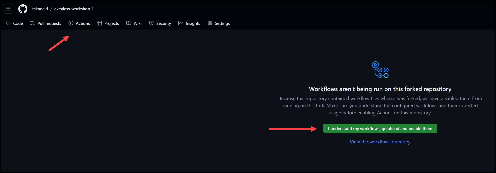
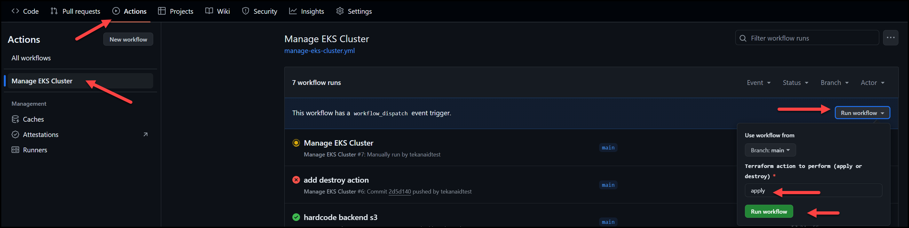
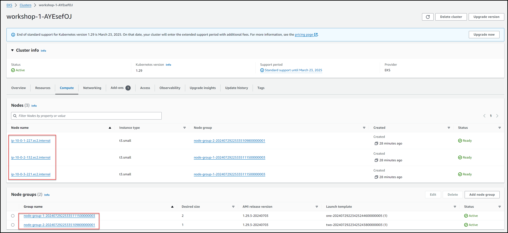

# Prepare the GitHub Actions Pipeline

In this lab we will get our pipeline ready and make sure we have the Akeyless plugin for GitHub Actions set up to retrieve the AWS Dynamic secret from the previous lab. This allows Terraform to use these AWS credentials to provision our EKS cluster in AWS.


<!-- @import "[TOC]" {cmd="toc" depthFrom=1 depthTo=6 orderedList=false} -->

<!-- code_chunk_output -->

- [Prepare the GitHub Actions Pipeline](#prepare-the-github-actions-pipeline)
  - [1. Create an OAuth2.0/JWT Authentication Method for GitHub](#1-create-an-oauth20jwt-authentication-method-for-github)
  - [2. Add the Access ID as a GitHub Repository Variable](#2-add-the-access-id-as-a-github-repository-variable)
  - [3. Create an Access Role](#3-create-an-access-role)
  - [4. Associate the Authentication Method with an Access Role](#4-associate-the-authentication-method-with-an-access-role)
  - [5. Set Read permissions for our AWS Dynamic Secret for the Access Role](#5-set-read-permissions-for-our-aws-dynamic-secret-for-the-access-role)
  - [6. Enable Workflows in your Repo](#6-enable-workflows-in-your-repo)
  - [7. Run the GitHub Actions Workflow](#7-run-the-github-actions-workflow)
  - [8. Check the AWS Console \[Optional\]](#8-check-the-aws-console-optional)
  - [9. Access the Cluster](#9-access-the-cluster)
    - [Congratulations on building your EKS cluster with Terraform and Akeyless!](#congratulations-on-building-your-eks-cluster-with-terraform-and-akeyless)

<!-- /code_chunk_output -->


## 1. Create an OAuth2.0/JWT Authentication Method for GitHub

We need to create an authentication method in Akeyless for GitHub. This is a way for GitHub to authenticate to Akeyless and retrieve the AWS credentials. We will use the JWT method so we don't have to hard-code API keys for Akeyless in GitHub. This is an elegant solution to solve the secret zero problem which is the first secret needed to retreive all other secrets.

Run the command below:

```bash
akeyless auth-method create oauth2 \
--name GitHubAuthWorkshop \
--jwks-uri https://token.actions.githubusercontent.com/.well-known/jwks \
--unique-identifier repository \
--force-sub-claims
```

Save the output Access ID as we will use it in the next step to store it as a GitHub Rpository Variable. I got `p-ankhb1k27xkfom` as an example access id.

## 2. Add the Access ID as a GitHub Repository Variable

You can store the Access ID as a GitHub variable inside the repository to use in your workflow.

In the following examples, instead of explicitly specifying the Access ID of the Authentication Method inside the workflow, we store it as a variable in the repository called `AKEYLESS_ACCESS_ID`.

On GitHub, navigate to the main page of the repository, and select Settings > Secrets and variables > Actions > Variables tab > New repository variable.
Enter the name for the variable as `AKEYLESS_ACCESS_ID` and set the value to your Auth Method Access ID.

Select Add Variable.


## 3. Create an Access Role

Run the command below:

```bash
akeyless create-role --name GitHubRoleWorkshop
```

## 4. Associate the Authentication Method with an Access Role

Run the command below, but first update your repository for `sub-claims`. This makes sure that the GitHub repository name is included in the JWT token.

```bash
akeyless assoc-role-am --role-name GitHubRoleWorkshop \
--am-name GitHubAuthWorkshop  \
--sub-claims repository=<octo-org/octo-repo> # replace with your repo name, mine is samgabrail/akeyless-workshop-1
```

## 5. Set Read permissions for our AWS Dynamic Secret for the Access Role

```bash
akeyless set-role-rule --role-name GitHubRoleWorkshop \
--path /Terraform/terraform-credentials \
--capability read
```

## 6. Enable Workflows in your Repo

Since you've forked this repo, you need to enable the GitHub Actions workflows. Go to the Actions tab and click the button `I understand my workflows, go ahead and enable them`.




## 7. Run the GitHub Actions Workflow

Go to the Actions tab, select the `Manage EKS Cluster` workflow and click the drop down button `Run workflow`, make sure the `action` selected is `apply` and then click the button `Run workflow`.



## 8. Check the AWS Console [Optional]

If you wish, you could log into the AWS console and see your EKS cluster there. Below is a snapshot of what you would see.



## 9. Access the Cluster

To get the kubeconfig for the cluster, run the command below replacing <your-eks-cluster-name> with your eks cluster name which will show up in the output of terraform or you can see in the AWS console.

```bash
aws eks update-kubeconfig --region us-east-1 --name <your-eks-cluster-name>
```

> Note: If after you run the pipeline and find that you get an error accessing the cluster, it could be that you need to refresh the AWS credentials you're using, that is if you are using the ones provided by TeKanAid Academy. You can refresh them by running the command: `/.start.sh` again.

You can now use `kubectl` to access the cluster.

Below are some suggested commands for you to run.

```bash
@tekanaid ➜ /workspaces/akeyless-workshop-1/terraform (main) $ kubens
default
kube-node-lease
kube-public
kube-system
@tekanaid ➜ /workspaces/akeyless-workshop-1/terraform (main) $ kubens kube-system
Context "arn:aws:eks:us-east-1:047709130171:cluster/workshop-1-AYEsefOJ" modified.
Active namespace is "kube-system".
@tekanaid ➜ /workspaces/akeyless-workshop-1/terraform (main) $ kga
NAME                                      READY   STATUS    RESTARTS   AGE
pod/aws-node-p9sc2                        2/2     Running   0          21m
pod/aws-node-pd6f6                        2/2     Running   0          21m
pod/aws-node-tltng                        2/2     Running   0          21m
pod/coredns-54d6f577c6-s6xfm              1/1     Running   0          44m
pod/coredns-54d6f577c6-x29rp              1/1     Running   0          44m
pod/ebs-csi-controller-7bb6f55486-25kx2   6/6     Running   0          22m
pod/ebs-csi-controller-7bb6f55486-g85fd   6/6     Running   0          22m
pod/ebs-csi-node-942jx                    3/3     Running   0          21m
pod/ebs-csi-node-vlvf6                    3/3     Running   0          21m
pod/ebs-csi-node-wsqlk                    3/3     Running   0          21m
pod/kube-proxy-brcvz                      1/1     Running   0          21m
pod/kube-proxy-qtdn5                      1/1     Running   0          21m
pod/kube-proxy-twhjb                      1/1     Running   0          21m

NAME               TYPE        CLUSTER-IP    EXTERNAL-IP   PORT(S)                  AGE
service/kube-dns   ClusterIP   172.20.0.10   <none>        53/UDP,53/TCP,9153/TCP   44m

NAME                                  DESIRED   CURRENT   READY   UP-TO-DATE   AVAILABLE   NODE SELECTOR              AGE
daemonset.apps/aws-node               3         3         3       3            3           <none>                     44m
daemonset.apps/ebs-csi-node           3         3         3       3            3           kubernetes.io/os=linux     22m
daemonset.apps/ebs-csi-node-windows   0         0         0       0            0           kubernetes.io/os=windows   22m
daemonset.apps/kube-proxy             3         3         3       3            3           <none>                     44m

NAME                                 READY   UP-TO-DATE   AVAILABLE   AGE
deployment.apps/coredns              2/2     2            2           44m
deployment.apps/ebs-csi-controller   2/2     2            2           22m

NAME                                            DESIRED   CURRENT   READY   AGE
replicaset.apps/coredns-54d6f577c6              2         2         2       44m
replicaset.apps/ebs-csi-controller-7bb6f55486   2         2         2       22m
```

### Congratulations on building your EKS cluster with Terraform and Akeyless!

> You've reached the end of the lab.