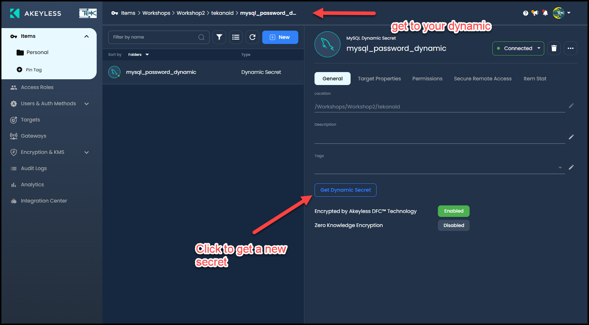
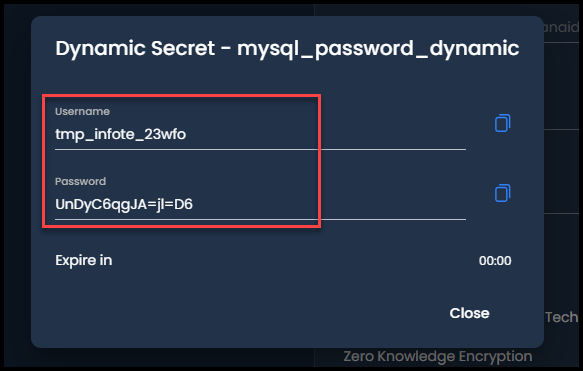

# Application Setup

This lab will help you set up the Flask App in your minikube Kubernetes cluster.

Key Objectives:
- Create a K8s Auth Method in Akeyless
- Expose the Akeyless API Gateway
- Run the deploy script
- Create a Dynamic Secret in Akeyless 

Table of Contents:

- [Application Setup](#application-setup)
  - [1. Create a K8s Auth Method in Akeyless](#1-create-a-k8s-auth-method-in-akeyless)
  - [2. Expose port 8081](#2-expose-port-8081)
  - [3. Run the deploy script](#3-run-the-deploy-script)
  - [4. Create a Dynamic Secret in Akeyless](#4-create-a-dynamic-secret-in-akeyless)

## 1. Create a K8s Auth Method in Akeyless

Run the following script to create a K8s Auth Method in Akeyless:

```bash
Lab04/create-k8s-auth.sh
```

This script does the following:

1. Creates a ServiceAccount named `gateway-token-reviewer` in the `akeyless` namespace
2. Creates a ClusterRoleBinding that gives the ServiceAccount permission to validate tokens (system:auth-delegator role)
3. Creates a ServiceAccount token by creating a Secret of type `kubernetes.io/service-account-token`
4. Waits for the token secret to be ready and available
5. Uses these credentials to set up Kubernetes authentication in Akeyless, allowing pods to authenticate using their ServiceAccount tokens
6. This allows our Flask App to authenticate with the Akeyless gateway using the ServiceAccount token without having to store the credentials in the pod solving the secret zero problem.


## 2. Expose port 8081

Run the following command to expose port 8081 which runs the akeyless api:

```bash
kubectl port-forward svc/gw-akeyless-api-gateway 8081:8081
```

## 3. Run the deploy script

Run the following command from the root of the repository in a terminal window to deploy the application:

```bash
Lab04/deploy-flask-todo.sh
```

This script automates the entire deployment process, from setting up infrastructure to configuring secrets management and deploying the application through ArgoCD.

It does the following:

1. Configures Akeyless CLI with API key credentials from `creds_api_key_auth.json`

2. Sets up configuration variables including:
   - Application name and namespace
   - Database name and dynamic secret TTL
   - ArgoCD connection details
   - Gets GitHub repository information

3. Constructs Akeyless Gateway URLs based on the Codespace environment:
   - Gateway URL for port 8000
   - Gateway API URL for port 8081

4. Fetches MySQL root password from Akeyless secret store

5. Creates Kubernetes resources:
   - Creates flask-todo namespace
   - Creates MySQL root password secret in the namespace

6. Logs into ArgoCD using admin credentials

7. Updates the `k8s-manifests/flask-deployment.yaml` file:
   - Updates Gateway URLs to match Codespace URLs
   - Updates K8s Auth Method access ID
   - Updates paths to match GitHub username

8. Commits and pushes changes to GitHub repository

9. Creates/Updates ArgoCD application:
   - Points to the k8s-manifests directory
   - Configures automated sync
   - Sets up namespace creation

10. Waits for MySQL pod to be ready

11. Creates Akeyless resources:
    - Creates MySQL database target with connection details
    - Creates MySQL dynamic secret with:
      - SQL statements for user creation/revocation
      - TTL configuration
      - Password requirements

12. Triggers final ArgoCD sync to deploy everything


> Note: The deploy script may result in some errors. The most common error is that the MySQL pod takes a while to start and the Akeyless dynamic secret fails to be created. So it's important to check the errors and running the script again usually resolves the issue. 

## 4. Create a Dynamic Secret in Akeyless

Navigate to the Akeyless UI and click on Items at the top left and navigate to your folder under `/Workshops/Workshop2/${GITHUB_USERNAME}`. You should see the dynamic secret `mysql_password_dynamic` created.



Then click on the button `Get Dynamic Secret` to generate a username and password for the MySQL database.



Now we want to get to see how our Flask App is using this dynamic secret to connect to the MySQL database. We will do this in the next lab.

> You've reached the end of the lab.
