# Setup Port

In this lab we will get Port setup. This section is based [on this guide](https://docs.getport.io/guides/all/create-eks-cluster-and-deploy-app/)

<!-- @import "[TOC]" {cmd="toc" depthFrom=1 depthTo=6 orderedList=false} -->

<!-- code_chunk_output -->

- [Setup Port](#setup-port)
  - [1. Sign up for Port](#1-sign-up-for-port)
  - [2. Install Port's GitHub app](#2-install-ports-github-app)
  - [3. Create the Region Blueprint](#3-create-the-region-blueprint)
  - [4. Create the EKS Cluster Blueprint](#4-create-the-eks-cluster-blueprint)
  - [5. Create a Port Action against the EKS Cluster Blueprint:](#5-create-a-port-action-against-the-eks-cluster-blueprint)
  - [6. Add AWS Regions](#6-add-aws-regions)
  - [7. Add Port Credentials to Akeyless](#7-add-port-credentials-to-akeyless)

<!-- /code_chunk_output -->

## 1. Sign up for Port

Go to https://www.getport.io/ and sign up for a free account.

Go through the onboarding process of creating an account, adding your first and last name, an organization, and then skip inviting teammates and adding a Version Control System.

Here is the screenshot of the onboarding process:

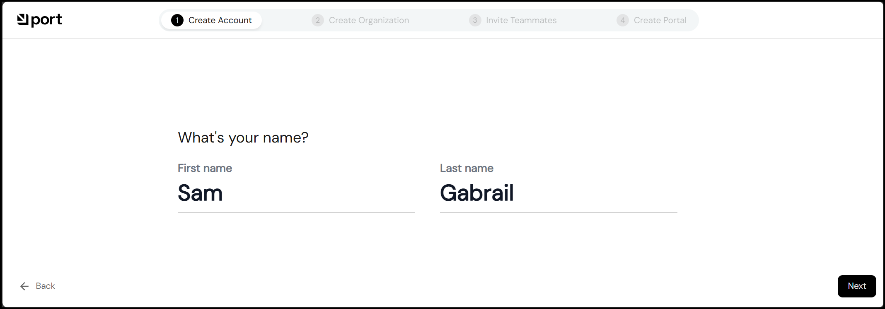

and here is the screenshot of your home page once you're onboarded:

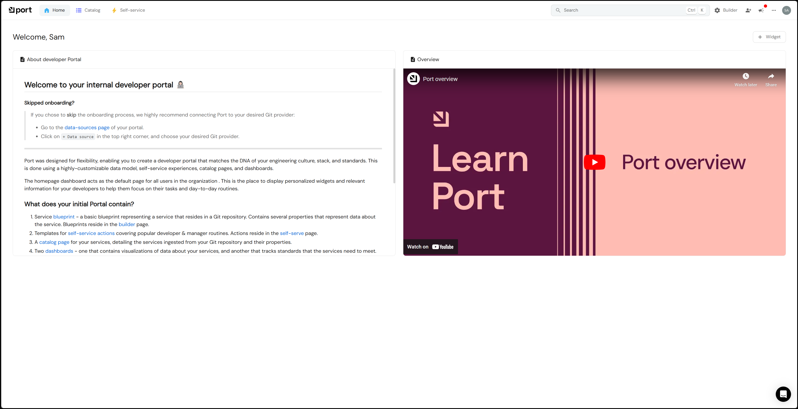

## 2. Install Port's GitHub app

Click this link to install Port's GitHub app: https://github.com/apps/getport-io/installations/new

Once you've successfully installed the app, you will see the data model get updated in Port. Go to Builder in the top right and click on "Data Model" to see the new data model.

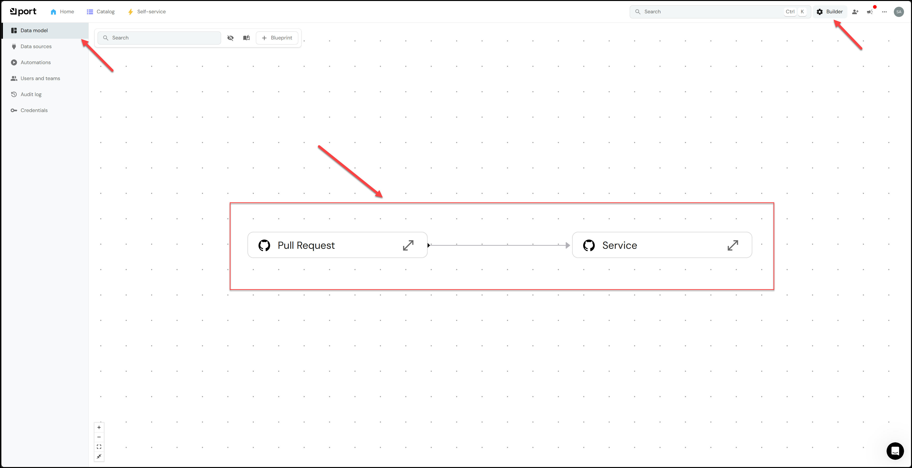

You will also see new Data Sources appear as shown below:

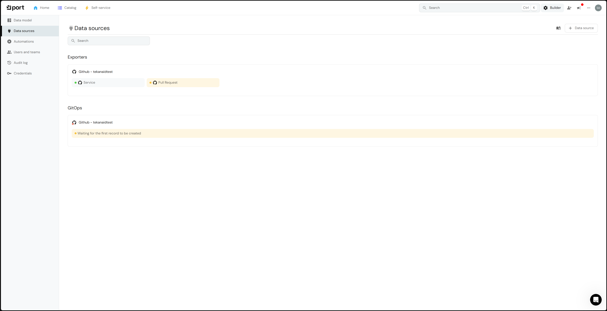

Finally, if you go to the Catalog and Services, you will see your GitHub repos there as shown below:

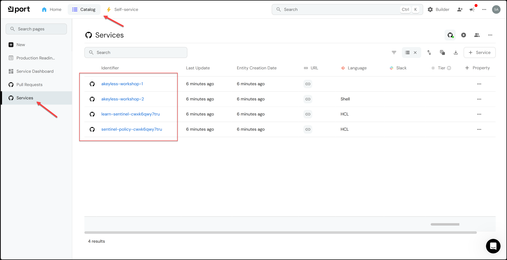

## 3. Create the Region Blueprint

Go to Builder in the top right and click on "Blueprints" then click on "Edit JSON" as shown below:

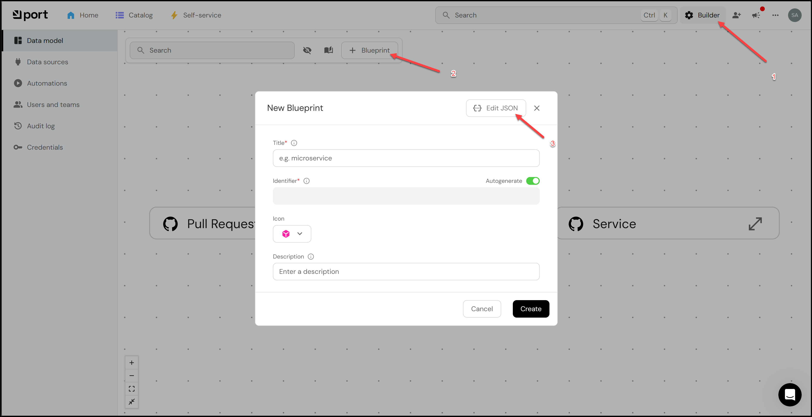

Next copy the content of the file `port/blueprints/region.json` in this repo and paste it into the JSON editor.

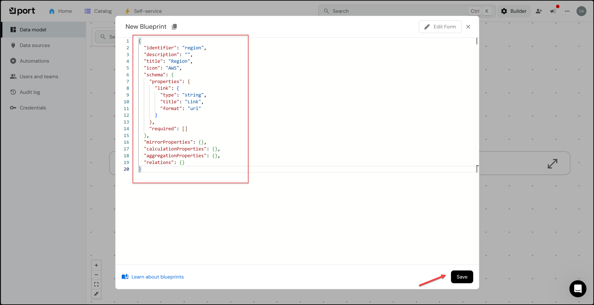

Finally, click on "Save" to save the blueprint. You will see the blueprint appear in the Data Model as shown below:

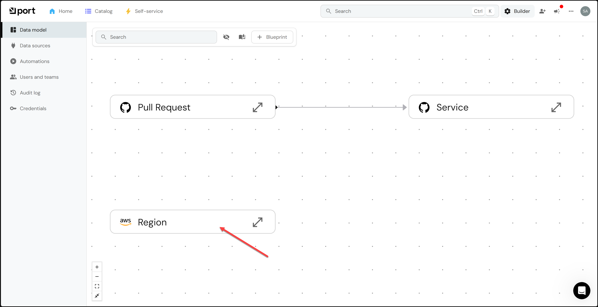

## 4. Create the EKS Cluster Blueprint

Follow the same steps as above to create the EKS Cluster Blueprint. The content of the file `port/blueprints/eks-cluster.json` in this repo should be pasted into the JSON editor. Your data model should look like this:

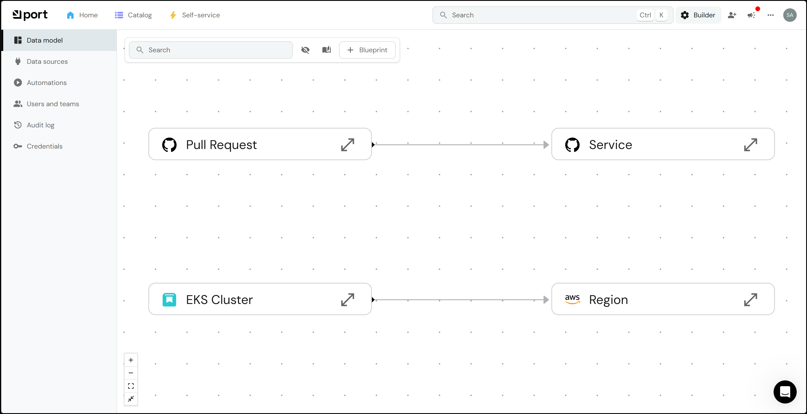

## 5. Create a Port Action against the EKS Cluster Blueprint:

a. Go to the self-service page.

b. Click on the + Action button.

c. Click on the {...} Edit JSON button in the top right corner.

d. Copy and paste the JSON configuration in the `port/self-service-actions/create_eks_cluster.json` file into the editor.

e. Make sure to **REPLACE in 2 places** the `your_org_name` and `your_repo_name` with your actual organization and repo name. You will find them in the `invocationMethod` section and in the `invocationMethod.workflowInputs.payload.invocationMethod`

f. Click Save

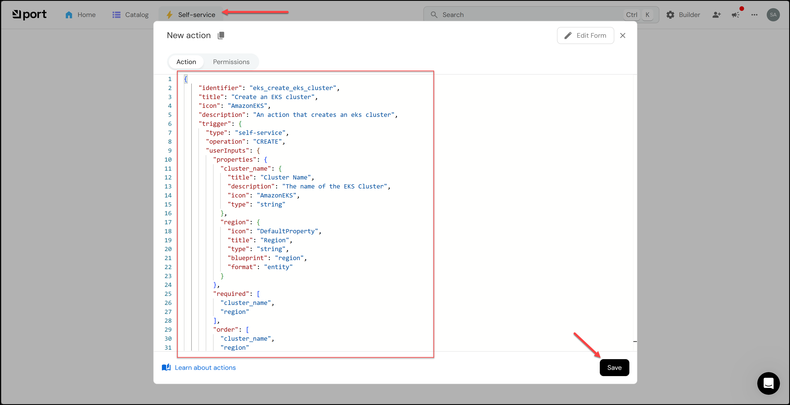

You should now see your new self-service action appear in the list of actions as shown below:

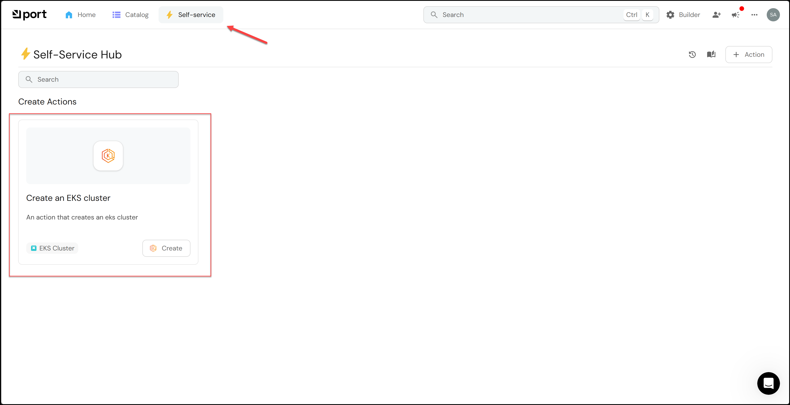

## 6. Add AWS Regions

Go to the `Catalog` page and click on `Regions` and then click on the `+ Region` button.

Fill out the form with the following values making sure to uncheck the `Autogenerate` radio button:
- Title: `us-east-1`
- Identifier: `us-east-1`

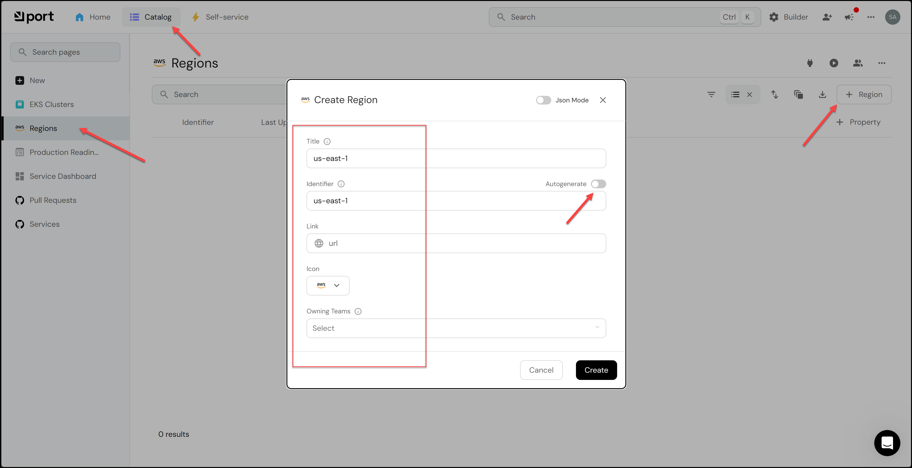

You could optionally add more regions if you wish.

## 7. Add Port Credentials to Akeyless

You now need to add the Port Client ID and Client Secret to Akeyless. You can find them in Port when you click on the 3 dots in the top right corner and then click on `Credentials`.

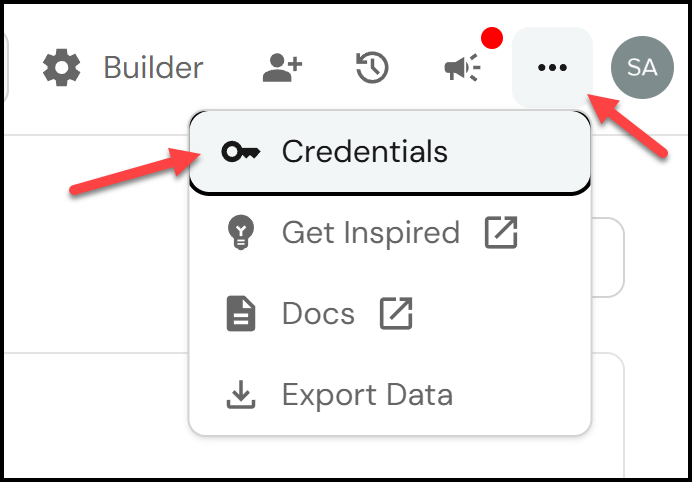

Then copy the credentials.

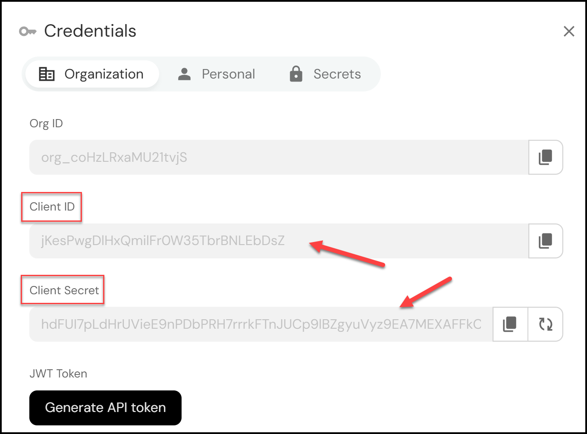

The script `add_port_creds.sh` in this Lab's directory will add the credentials to Akeyless. Run it below and it will prompt you for the credentials.

```bash
Lab04/add_port_creds.sh
```

> You've reached the end of the lab.
