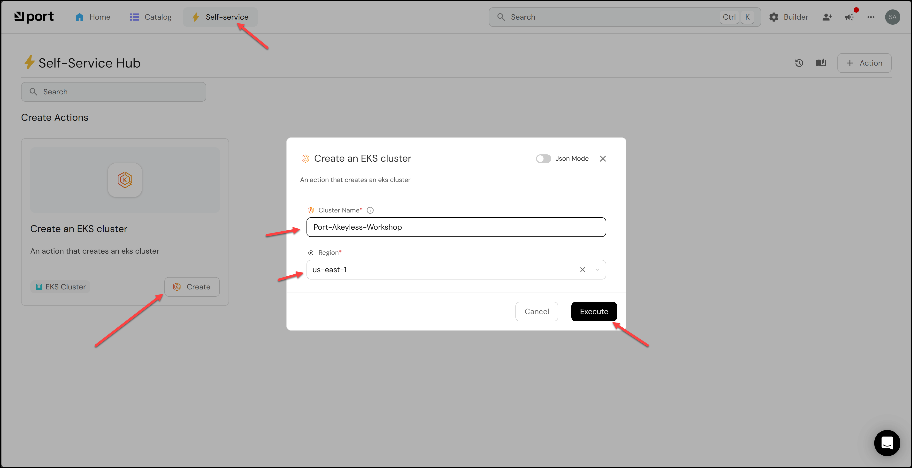
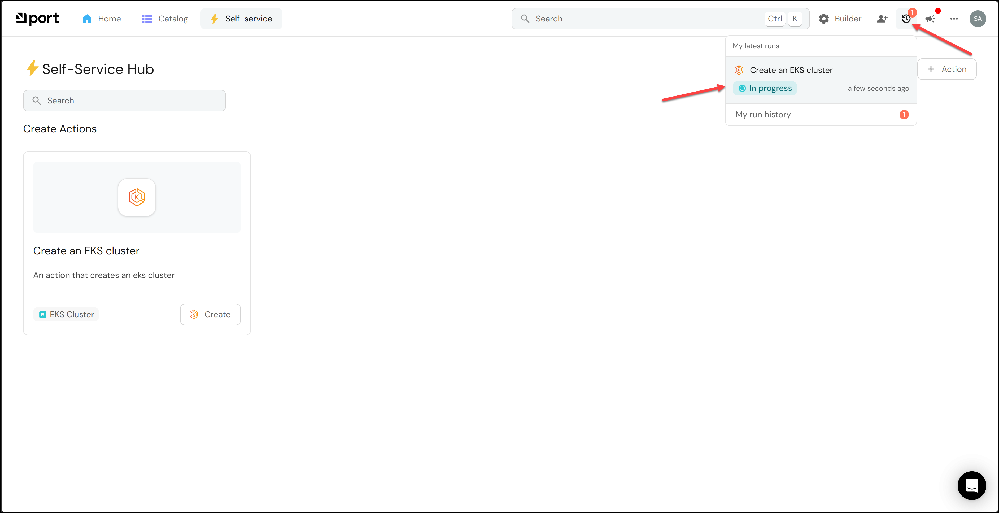
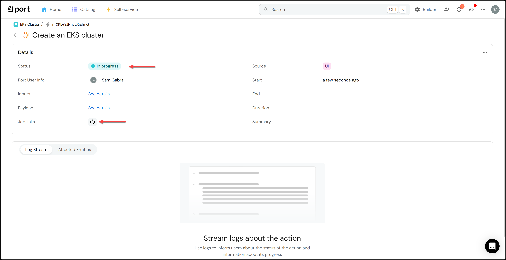
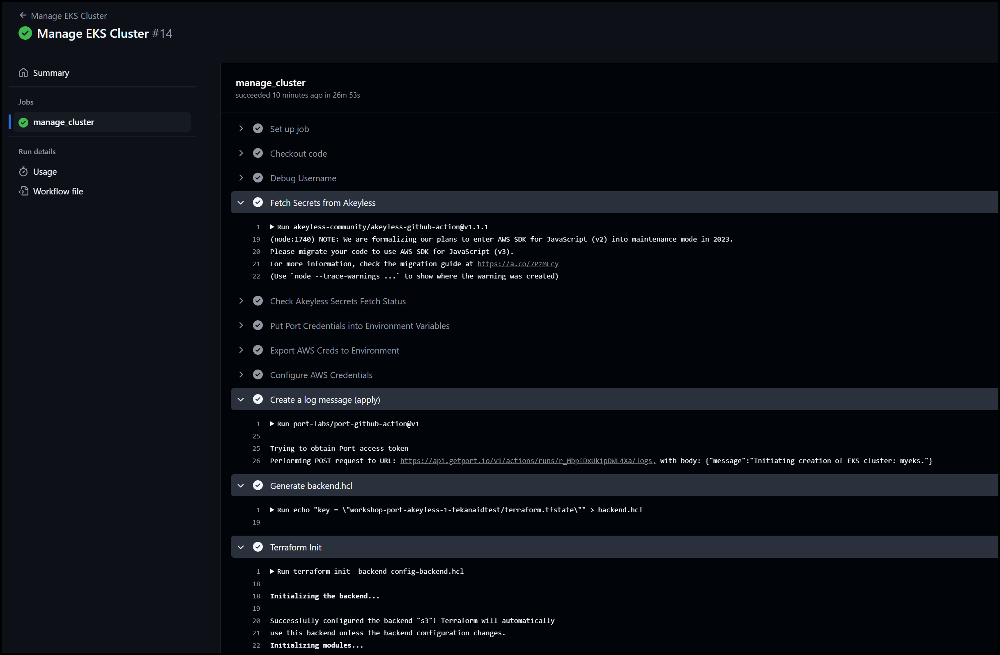
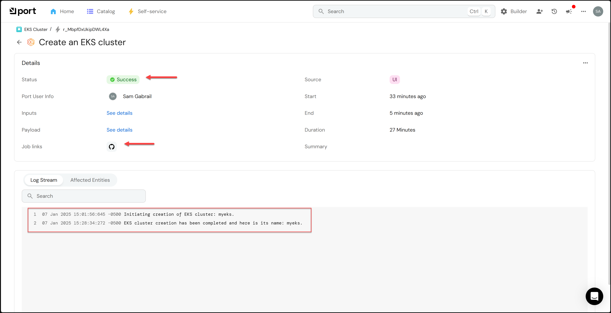
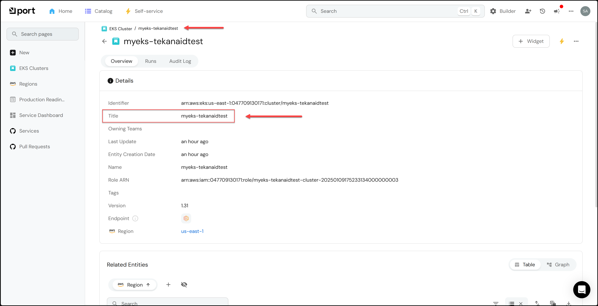

# Build the EKS Cluster

In this lab we will build the EKS cluster from Port.

<!-- @import "[TOC]" {cmd="toc" depthFrom=1 depthTo=6 orderedList=false} -->

<!-- code_chunk_output -->

- [Build the EKS Cluster](#build-the-eks-cluster)
  - [1. Add IAM Users to the AWS Auth ConfigMap](#1-add-iam-users-to-the-aws-auth-configmap)
  - [2. Commit and Push the Changes](#2-commit-and-push-the-changes)
  - [3. Create an EKS Cluster](#3-create-an-eks-cluster)
  - [4. Check the GitHub Actions Workflow](#4-check-the-github-actions-workflow)
  - [5. Access the Cluster](#5-access-the-cluster)

<!-- /code_chunk_output -->

## 1. Add IAM Users to the AWS Auth ConfigMap

To be able to access the EKS cluster, we need to add the IAM users to the AWS Auth ConfigMap. Run the following command:

```bash
USERNAME=$(cat /tmp/aws-credentials | jq -r .user) && \
sed -i "s/USERNAME/${USERNAME}/g" terraform/main.tf
```

## 2. Commit and Push the Changes

Before we can create an EKS cluster, we need to commit and push the changes to the repository. Mainly, we need to update the Gateway URL in the GitHub Actions Workflow. The Gateway URL is stored in the file `akeyless_gateway_url.txt` in the root of this repository. The workflow will read this file and use the URL for multiple purposes. In addition to the IAM users added to main.tf.

In a terminal, run the following commands:

```bash
git add .
git commit -m "Update the Gateway URL in the GitHub Actions Workflow"
git push
```

## 3. Create an EKS Cluster

Go to the self-service page and click on the `Create` button under the `Create an EKS Cluster` action. Give it a short name (otherwise EKS may complain) and select the us-east-1 region then click `Execute`.



You can then see the run progress by clicking the `My latest runs` button at the top right.



## 4. Check the GitHub Actions Workflow

After a few seconds, a GitHub icon will appear and if you click it, it will take you to the GitHub Actions workflow.



You can check the GitHub actions workflow to see the progress of the run.



Finally, when the EKS cluster is created (takes about 35 minutes), you will see it in the Port UI.



## 5. Access the Cluster

To get the kubeconfig for the cluster, run the command below replacing <your-eks-cluster-name> with your eks cluster name which will show up in the Port UI as shown in the two screenshots below:




Run the following command:

```bash
aws eks update-kubeconfig --region us-east-1 --role-arn arn:aws:iam::047709130171:role/github-actions-eks-role --name <your-eks-cluster-name>
```

> Note: If after you run the pipeline and find that you get an error accessing the cluster, it could be that you need to refresh the AWS credentials you're using, that is if you are using the ones provided by TeKanAid Academy. You can refresh them by running the command: `Lab01/start.sh` again. You will also need to update the AWS credentials in the `terraform/main.tf` file.

You can now use `kubectl` to access the cluster.

Below are some suggested commands for you to run.

```bash
kubens # alias for kubectl get namespaces
```

Output:
```
default
kube-node-lease
kube-public
kube-system
```

```bash
kubens kube-system # to switch to the kube-system namespace
```

Output:
```
Context "arn:aws:eks:us-east-1:047709130171:cluster/workshop-1-AYEsefOJ" modified.
Active namespace is "kube-system".

```bash
kga # alias for kubectl get all
```

Output:
```
NAME                                      READY   STATUS    RESTARTS   AGE
pod/aws-node-p9sc2                        2/2     Running   0          21m
pod/aws-node-pd6f6                        2/2     Running   0          21m
pod/aws-node-tltng                        2/2     Running   0          21m
pod/coredns-54d6f577c6-s6xfm              1/1     Running   0          44m
pod/coredns-54d6f577c6-x29rp              1/1     Running   0          44m
pod/ebs-csi-controller-7bb6f55486-25kx2   6/6     Running   0          22m
pod/ebs-csi-controller-7bb6f55486-g85fd   6/6     Running   0          22m
pod/ebs-csi-node-942jx                    3/3     Running   0          21m
pod/ebs-csi-node-vlvf6                    3/3     Running   0          21m
pod/ebs-csi-node-wsqlk                    3/3     Running   0          21m
pod/kube-proxy-brcvz                      1/1     Running   0          21m
pod/kube-proxy-qtdn5                      1/1     Running   0          21m
pod/kube-proxy-twhjb                      1/1     Running   0          21m

NAME               TYPE        CLUSTER-IP    EXTERNAL-IP   PORT(S)                  AGE
service/kube-dns   ClusterIP   172.20.0.10   <none>        53/UDP,53/TCP,9153/TCP   44m

NAME                                  DESIRED   CURRENT   READY   UP-TO-DATE   AVAILABLE   NODE SELECTOR              AGE
daemonset.apps/aws-node               3         3         3       3            3           <none>                     44m
daemonset.apps/ebs-csi-node           3         3         3       3            3           kubernetes.io/os=linux     22m
daemonset.apps/ebs-csi-node-windows   0         0         0       0            0           kubernetes.io/os=windows   22m
daemonset.apps/kube-proxy             3         3         3       3            3           <none>                     44m

NAME                                 READY   UP-TO-DATE   AVAILABLE   AGE
deployment.apps/coredns              2/2     2            2           44m
deployment.apps/ebs-csi-controller   2/2     2            2           22m

NAME                                            DESIRED   CURRENT   READY   AGE
replicaset.apps/coredns-54d6f577c6              2         2         2       44m
replicaset.apps/ebs-csi-controller-7bb6f55486   2         2         2       22m
```

> You've reached the end of the lab.