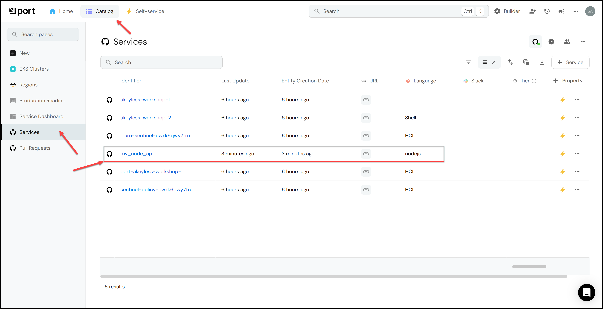
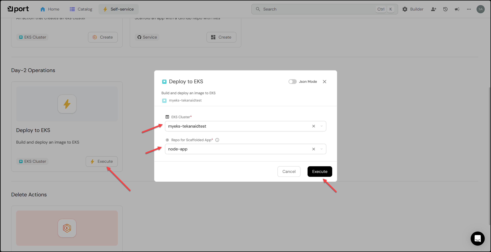
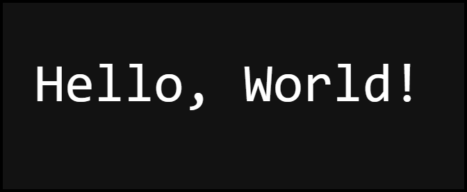

# Deploy a Nodejs App

In this lab we will deploy an app to the EKS cluster from within Port.

- [Deploy a Nodejs App](#deploy-a-nodejs-app)
  - [1. Add GitHub Personal Access Token credentials to Akeyless](#1-add-github-personal-access-token-credentials-to-akeyless)
  - [2. Prepare to Scaffold a Nodejs App](#2-prepare-to-scaffold-a-nodejs-app)
  - [3. Run the self-service action](#3-run-the-self-service-action)
  - [4. Deploy the app to the EKS cluster](#4-deploy-the-app-to-the-eks-cluster)
  - [5. Check the app](#5-check-the-app)
  - [6. Delete the app](#6-delete-the-app)

## 1. Add GitHub Personal Access Token credentials to Akeyless

You will need to add your GitHub Personal Access Token credentials to Akeyless. So that Port can issue a GitHub Actions workflow to scaffold an app.

Follow the instructions below to get your GitHub PAT credentials.

1. Go to https://github.com/settings/tokens
2. Click on `Generate new token (classic)`
3. Enter a name for the token, for example `Port-Scaffold-App`
4. Select the `repo` scope
5. Click on `Generate token`
6. Copy the token to your clipboard


Run the `add_pat_cred.sh` script to add your GitHub PAT credentials to Akeyless.

```bash
Lab06/add_pat_cred.sh
```

> Note: Don't worry if you run into some 404 errors, just make sure you get a message like this at the very end:
```
A new secret named /Workshops/Akeyless-Port-1/tekanaid/github/pat was successfully created
```

## 2. Prepare to Scaffold a Nodejs App

a. Go to the self-service page.

b. Click on the + Action button.

c. Click on the {...} Edit JSON button in the top right corner.

d. Copy and paste the JSON configuration in the port/self-service-actions/scaffold_an_app.json file into the editor.

e. Make sure to REPLACE in 2 places the your_org_name and your_repo_name with your actual organization and repo name. You will find them in the invocationMethod section and in the invocationMethod.workflowInputs.payload.invocationMethod

f. Click Save

## 3. Run the self-service action

This action will create the following:

- A GitHub repository containing a starter Node.js app.
- Since the repository is created with a `port.yml` file, the Port GitHub app will create the repository entity automatically.
- An ECR repository for the app.

Click on the action you just created using the `nodejs` template and click `Execute`.

> Note: for the Repository Name: don't use underscores as the app will fail to deploy since K8s does not allow that. Just use something like mynodeapp


You will see the self-service action running in the UI and will succeed as shown below.


Then you can check the catalog to see the new repo created as shown below.



## 4. Deploy the app to the EKS cluster

On the self-service page, create a Port action using the JSON configuration in the `port/self-service-actions/deploy_to_eks_action.json` file.

Make sure to REPLACE in 2 places the your_org_name and your_repo_name with your actual organization and repo name. You will find them in the invocationMethod section and in the invocationMethod.workflowInputs.payload.invocationMethod

After you create the action, click on it and click `Execute`.



This self-service action will:

- Build the docker image.
- Push it to the ECR repository.
- Deploy it to the cluster.

## 5. Check the app

To check the app, you will need to get the kubeconfig for the cluster, if you don't have it already.
Run the following command:

```bash
aws eks update-kubeconfig --region us-east-1 --role-arn arn:aws:iam::047709130171:role/github-actions-eks-role --name <your-eks-cluster-name>
```

> Note: If after you run the pipeline and find that you get an error accessing the cluster, it could be that you need to refresh the AWS credentials you're using, that is if you are using the ones provided by TeKanAid Academy. You can refresh them by running the command: `Lab01/start.sh` again.

Then run:

```bash
kubens default
kga
```

You should see the output similar to this:


```bash
NAME                                        READY   STATUS    RESTARTS   AGE
pod/mynodeapp-deployment-7cdb766dbc-2mclr   1/1     Running   0          35m
pod/mynodeapp-deployment-7cdb766dbc-hvnsz   1/1     Running   0          35m
pod/mynodeapp-deployment-7cdb766dbc-vcf6n   1/1     Running   0          35m

NAME                        TYPE           CLUSTER-IP     EXTERNAL-IP                                                             PORT(S)        AGE
service/kubernetes          ClusterIP      172.20.0.1     <none>                                                                  443/TCP        102m
service/mynodeapp-service   LoadBalancer   172.20.15.82   a8e7f04292d3546cb8b64205606d9c10-67743035.us-east-1.elb.amazonaws.com   80:31747/TCP   35m

NAME                                   READY   UP-TO-DATE   AVAILABLE   AGE
deployment.apps/mynodeapp-deployment   3/3     3            3           35m

NAME                                              DESIRED   CURRENT   READY   AGE
replicaset.apps/mynodeapp-deployment-7cdb766dbc   3         3         3       35m
```

Now you see how the app is running in the cluster. 

After waiting a couple of minutes, you can open a new browser tab and navigate to the LoadBalancer service's URL to access the app. In my case it was: http://a8e7f04292d3546cb8b64205606d9c10-67743035.us-east-1.elb.amazonaws.com



Congratulations! You've successfully deployed an app to the EKS cluster using Port and Akeyless!

## 6. Delete the app

Run the following commands to delete the app:

```bash
kubectl delete deployment --all -n default
kubectl get svc -n default --no-headers | grep -v kubernetes | awk '{print $1}' | xargs kubectl delete service
```

These commands:
- Delete all deployments in the default namespace
- Delete all services EXCEPT the kubernetes service

> You've reached the end of the lab.

