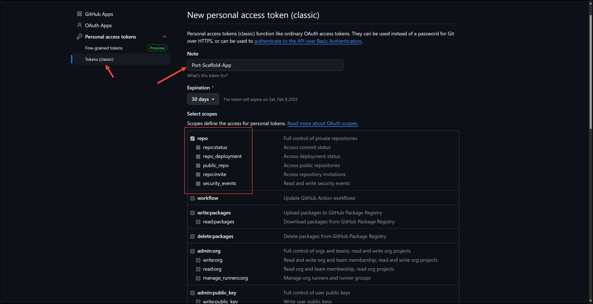
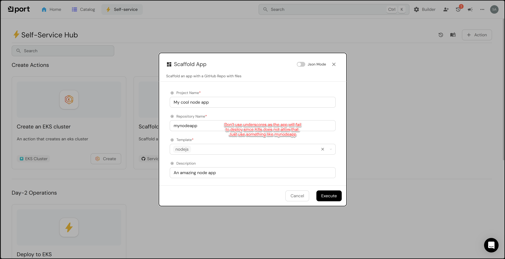

# Deploy an App

In this lab we will deploy an app to the EKS cluster from within Port.

- [Deploy an App](#deploy-an-app)
  - [1. Add GitHub Personal Access Token credentials to Akeyless](#1-add-github-personal-access-token-credentials-to-akeyless)
  - [2. Prepare to Scaffold a Nodejs App](#2-prepare-to-scaffold-a-nodejs-app)
  - [2. Run the self-service action](#2-run-the-self-service-action)

## 1. Add GitHub Personal Access Token credentials to Akeyless

You will need to add your GitHub Personal Access Token credentials to Akeyless. So that Port can issue a GitHub Actions workflow to scaffold an app.

Follow the instructions below to get your GitHub PAT credentials.

1. Go to https://github.com/settings/tokens
2. Click on `Generate new token (classic)`
3. Enter a name for the token, for example `Port-Scaffold-App`
4. Select the `repo` scope
5. Click on `Generate token`
6. Copy the token to your clipboard




Run the `add_pat_cred.sh` script to add your GitHub PAT credentials to Akeyless.

```bash
Lab06/add_pat_cred.sh
```

## 2. Prepare to Scaffold a Nodejs App

a. Go to the self-service page.

b. Click on the + Action button.

c. Click on the {...} Edit JSON button in the top right corner.

d. Copy and paste the JSON configuration in the port/self-service-actions/scaffold_an_app.json file into the editor.

e. Make sure to REPLACE in 2 places the your_org_name and your_repo_name with your actual organization and repo name. You will find them in the invocationMethod section and in the invocationMethod.workflowInputs.payload.invocationMethod

f. Click Save

## 2. Run the self-service action

Click on the action you just created using the `nodejs` template and click `Execute`.




> You've reached the end of the lab.
