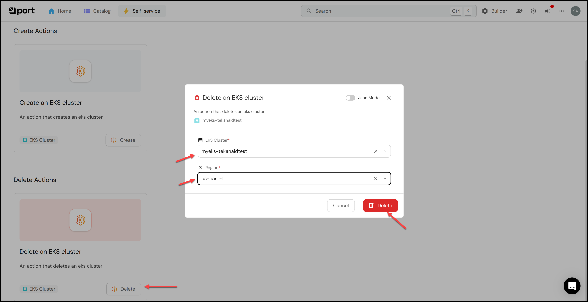
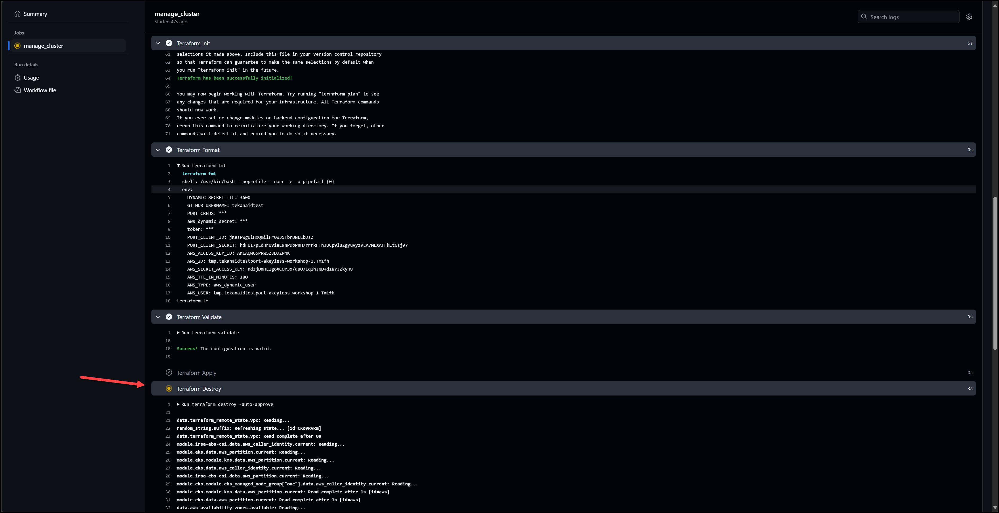

# Destroy the EKS Cluster

In this lab we will destroy the EKS cluster from within Port.

- [Destroy the EKS Cluster](#destroy-the-eks-cluster)
  - [1. Create a self-service action in Port](#1-create-a-self-service-action-in-port)
  - [2. Run the self-service action](#2-run-the-self-service-action)
  - [3. Check the AWS Console \[Optional\]](#3-check-the-aws-console-optional)

## 1. Create a self-service action in Port

a. Go to the self-service page.

b. Click on the + Action button.

c. Click on the {...} Edit JSON button in the top right corner.

d. Copy and paste the JSON configuration in the port/self-service-actions/delete_eks_cluster.json file into the editor.

e. Make sure to REPLACE in 2 places the your_org_name and your_repo_name with your actual organization and repo name. You will find them in the invocationMethod section and in the invocationMethod.workflowInputs.payload.invocationMethod

f. Click Save

## 2. Run the self-service action

Click on the action you just created and notice that Port recognizes the existing EKS cluster as an entity.

You will see that the action is in progress and will trigger a GitHub Actions workflow, but this time Terraform destroy will be run.

## 3. Check the AWS Console [Optional]

Wait about 15 minutes or so and if you wish, you could log into the AWS console and see your EKS cluster is removed.

> You've reached the end of the lab.